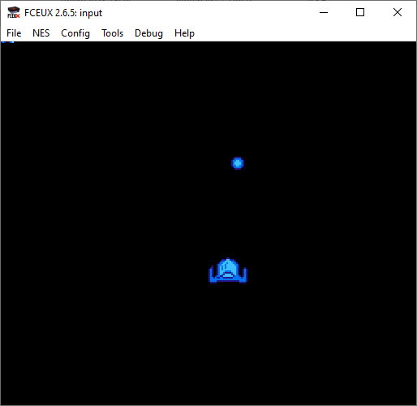
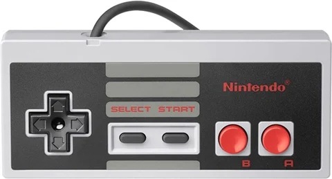

# NES input

Use the up / down / left / right buttons on the NES controller to move the sprite around on screen

## How to assemble

Step 1: Assemble asm file into an object file

**ca65 input.asm -o input.o -t nes**

Step 2: link the object file to the nes target (yields a .NES rom for use with emulator, tested on Fceux)

**ld65 input.o -o input.nes -t nes**

# Info

Button status for each controller is returned in the following order: A, B, Select, Start, Up, Down, Left, Right.

# Links

## FCEUX:

Emulator used for testing

https://fceux.com/web/home.html

## CC65 (CA65)

Assembler used

https://www.cc65.org/

## More info

See Nerdy Nights tutorial

https://nerdy-nights.nes.science/#main_tutorial-5